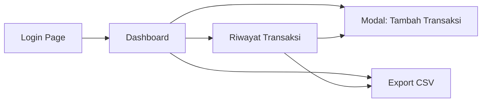

# Finance Dashboard MVP — Frontend Implementation Plan

Membangun frontend dashboard keuangan perusahaan dengan fokus pada **kesederhanaan, kecepatan, dan akurasi data**. Aplikasi ini SPA (Single Page Application) berbasis Vite + vanilla JS + vanilla CSS — tanpa framework berat.

---

## User Review Required

> [!IMPORTANT]
> **Data storage MVP**: Untuk MVP ini, data transaksi akan disimpan di **localStorage** browser. Belum ada backend/API.

---

## Desain UI/UX

### Color Palette & Design Language

| Token | Value | Kegunaan |
|---|---|---|
| `--bg-primary` | `#0F172A` | Background utama (dark mode) |
| `--bg-card` | `#1E293B` | Card & panel |
| `--bg-card-hover` | `#334155` | Card hover state |
| `--accent-green` | `#22C55E` | Pemasukan, positif, sukses |
| `--accent-red` | `#EF4444` | Pengeluaran, negatif, bahaya |
| `--accent-blue` | `#3B82F6` | Primary action, link |
| `--accent-purple` | `#A855F7` | Saldo / highlight |
| `--text-primary` | `#F8FAFC` | Teks utama |
| `--text-secondary` | `#94A3B8` | Teks pendukung |
| `--border` | `#334155` | Border halus |

**Design language**: Dark mode, glassmorphism cards dengan `backdrop-filter: blur()`, subtle gradient accents, smooth micro-animations (200-300ms transitions). Typography: **Inter** dari Google Fonts.

### Struktur Halaman & Navigasi



**Navigasi** menggunakan **sidebar** (desktop) / **bottom nav** (mobile) dengan 3 menu utama:

| Icon | Label | Halaman |
|---|---|---|
| 🏠 | Dashboard | Ringkasan saldo + quick stats |
| 📋 | Riwayat | Tabel transaksi + filter |
| ➕ | Tambah | Modal/overlay input transaksi |

---

## Proposed Changes

### 1. Project Setup

#### [NEW] [package.json](file:///c:/Users/Lenovo/Documents/Yusuf%20Kamal/Website-AI/package.json)
- Inisialisasi Vite project dengan vanilla JS template
- Dependency: hanya `vite` (dev)

#### [NEW] [index.html](file:///c:/Users/Lenovo/Documents/Yusuf%20Kamal/Website-AI/index.html)
- Entry point HTML dengan meta tags SEO, Google Fonts (Inter), dan root container

---

### 2. Design System

#### [NEW] [src/styles/variables.css](file:///c:/Users/Lenovo/Documents/Yusuf%20Kamal/Website-AI/src/styles/variables.css)
- CSS custom properties: colors, spacing, typography, shadows, border-radius
- Glassmorphism utility classes

#### [NEW] [src/styles/main.css](file:///c:/Users/Lenovo/Documents/Yusuf%20Kamal/Website-AI/src/styles/main.css)
- Reset/normalize, global styles, layout grid, responsive breakpoints
- Animation keyframes (fadeIn, slideUp, pulse)
- Component base styles (cards, buttons, inputs, tables, badges, modals)

---

### 3. Application Core

#### [NEW] [src/main.js](file:///c:/Users/Lenovo/Documents/Yusuf%20Kamal/Website-AI/src/main.js)
- Entry point: router sederhana (hash-based), init app, event delegation
- Import semua module

#### [NEW] [src/router.js](file:///c:/Users/Lenovo/Documents/Yusuf%20Kamal/Website-AI/src/router.js)
- Simple hash router (`#/dashboard`, `#/history`, `#/login`)
- Render halaman sesuai hash, default ke `#/login`

#### [NEW] [src/store.js](file:///c:/Users/Lenovo/Documents/Yusuf%20Kamal/Website-AI/src/store.js)
- LocalStorage wrapper untuk CRUD transaksi
- Fungsi: `getTransactions()`, `addTransaction()`, `deleteTransaction()`, `getBalance()`, `getSummary(month)`
- Schema per transaksi: `{ id, type, amount, category, date, description }`

---

### 4. Komponen UI

#### [NEW] [src/components/sidebar.js](file:///c:/Users/Lenovo/Documents/Yusuf%20Kamal/Website-AI/src/components/sidebar.js)
- Sidebar navigasi (desktop) + bottom nav (mobile)
- Active state indicator animasi smooth
- Logo/nama app di atas sidebar

#### [NEW] [src/components/summary-cards.js](file:///c:/Users/Lenovo/Documents/Yusuf%20Kamal/Website-AI/src/components/summary-cards.js)
- 3 kartu glassmorphism: **Total Saldo** (purple), **Pemasukan** (green), **Pengeluaran** (red)
- Angka besar + ikon + label
- Format angka: `Rp 12.500.000`

#### [NEW] [src/components/line-chart.js](file:///c:/Users/Lenovo/Documents/Yusuf%20Kamal/Website-AI/src/components/line-chart.js)
- **Line chart besar** di bawah summary cards menggunakan **Canvas API** (tanpa library eksternal)
- Menampilkan 2 garis: **Pemasukan** (hijau) vs **Pengeluaran** (merah) per hari dalam bulan berjalan
- Fitur: grid lines, tooltip on hover, label sumbu X (tanggal) & Y (nominal), legend
- Animasi draw-in saat pertama kali render
- Responsif: menyesuaikan ukuran container

#### [NEW] [src/components/transaction-form.js](file:///c:/Users/Lenovo/Documents/Yusuf%20Kamal/Website-AI/src/components/transaction-form.js)
- Modal overlay dengan form:
  - Toggle: Pemasukan / Pengeluaran (pill switch)
  - Input: Nominal (formatted currency)
  - Dropdown: Kategori (Gaji, Sewa, Alat Kantor, Penjualan, Transport, Makan, Lainnya)
  - Input: Tanggal (default: hari ini)
  - Input: Keterangan singkat
  - Tombol: Simpan + Batal
- Validasi sederhana (nominal wajib, kategori wajib)

#### [NEW] [src/components/transaction-table.js](file:///c:/Users/Lenovo/Documents/Yusuf%20Kamal/Website-AI/src/components/transaction-table.js)
- Tabel responsif dengan kolom: Tanggal, Kategori, Keterangan, Nominal, Tipe (badge)
- Sorting by date (terbaru di atas)
- Empty state illustration
- Tombol hapus per baris

#### [NEW] [src/components/filter-bar.js](file:///c:/Users/Lenovo/Documents/Yusuf%20Kamal/Website-AI/src/components/filter-bar.js)
- Pill buttons: Hari Ini, Minggu Ini, Bulan Ini, Semua
- Active state visual

#### [NEW] [src/components/export-button.js](file:///c:/Users/Lenovo/Documents/Yusuf%20Kamal/Website-AI/src/components/export-button.js)
- Tombol "📥 Export CSV" — generate CSV dari data yang tampil, trigger download

---

### 5. Halaman

#### [NEW] [src/pages/login.js](file:///c:/Users/Lenovo/Documents/Yusuf%20Kamal/Website-AI/src/pages/login.js)
- Halaman login sederhana: username + password + tombol masuk
- MVP: hardcoded credential (admin/admin) — hanya gerbang UI, bukan security
- Animasi masuk (fade + slide up)

#### [NEW] [src/pages/dashboard.js](file:///c:/Users/Lenovo/Documents/Yusuf%20Kamal/Website-AI/src/pages/dashboard.js)
- Komposisi: SummaryCards + **LineChart** + 5 transaksi terakhir (mini-table) + tombol "Tambah Transaksi"
- Greeting: "Selamat pagi/siang/sore, Admin 👋"

#### [NEW] [src/pages/history.js](file:///c:/Users/Lenovo/Documents/Yusuf%20Kamal/Website-AI/src/pages/history.js)
- Komposisi: FilterBar + TransactionTable + ExportButton
- Full-width content area

---

### 6. Utilities

#### [NEW] [src/utils/format.js](file:///c:/Users/Lenovo/Documents/Yusuf%20Kamal/Website-AI/src/utils/format.js)
- `formatCurrency(number)` → `Rp 12.500.000`
- `formatDate(dateString)` → `16 Mar 2026`
- `getGreeting()` → Selamat pagi/siang/sore/malam

#### [NEW] [src/utils/csv.js](file:///c:/Users/Lenovo/Documents/Yusuf%20Kamal/Website-AI/src/utils/csv.js)
- `exportToCSV(transactions)` → trigger file download `.csv`

---

## Wireframe Layout

```
┌──────────────────────────────────────────────────────────┐
│  SIDEBAR          │           MAIN CONTENT              │
│  ┌─────────────┐  │  ┌─────────────────────────────────┐│
│  │  💰 FinApp  │  │  │ Selamat siang, Admin 👋         ││
│  ├─────────────┤  │  ├─────────────────────────────────┤│
│  │ 🏠 Dashboard│◄─│  │  [Saldo]   [Masuk]   [Keluar]  ││
│  │ 📋 Riwayat  │  │  │   ▓▓▓▓      ▓▓▓▓      ▓▓▓▓    ││
│  │             │  │  ├─────────────────────────────────┤│
│  │             │  │  │  📈 Grafik Pemasukan vs         ││
│  │             │  │  │     Pengeluaran Bulan Ini        ││
│  │             │  │  │  ╱╲    ╱╲                       ││
│  │             │  │  │ ╱  ╲╱╱  ╲    ── Pemasukan       ││
│  │             │  │  │╱        ╲╱   ── Pengeluaran     ││
│  │             │  │  ├─────────────────────────────────┤│
│  │             │  │  │  Transaksi Terakhir              ││
│  │             │  │  │  ┌───┬────┬──────┬───────┐      ││
│  │             │  │  │  │Tgl│Kat │Ket   │Nominal│      ││
│  │             │  │  │  ├───┼────┼──────┼───────┤      ││
│  │             │  │  │  │...│... │...   │ ...   │      ││
│  │             │  │  │  └───┴────┴──────┴───────┘      ││
│  ├─────────────┤  │  └─────────────────────────────────┘│
│  │ [+ Tambah]  │  │                                     │
│  └─────────────┘  │                                     │
└──────────────────────────────────────────────────────────┘
```

---

## Verification Plan

### Browser Testing (via browser tool)
1. Jalankan `npm run dev` dari folder project
2. Buka browser ke `http://localhost:5173`
3. **Test Login**: masukkan admin/admin → harus redirect ke Dashboard
4. **Test Dashboard**: pastikan 3 kartu summary muncul, greeting sesuai waktu
5. **Test Tambah Transaksi**: klik "+ Tambah", isi form, simpan → data muncul di tabel
6. **Test Riwayat**: navigasi ke Riwayat, pastikan tabel terisi, filter berfungsi
7. **Test Export**: klik Export CSV, pastikan file `.csv` ter-download
8. **Test Responsif**: resize browser ke ukuran mobile, pastikan bottom nav muncul

### Manual Verification (oleh user)
- User diminta membuka browser dan mencoba alur lengkap: Login → Dashboard → Tambah Transaksi → Cek Riwayat → Export CSV
- User memvalidasi apakah tampilan dan nuansa UI sudah sesuai ekspektasi
